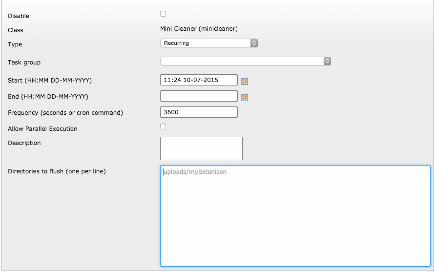

.. ==================================================
.. FOR YOUR INFORMATION
.. --------------------------------------------------
.. -*- coding: utf-8 -*- with BOM.

.. include:: ../Includes.txt

.. _admin-manual:

Administrator Manual
====================

Target group: **Administrators**

Installation
------------

Just install with Extension Manager and create a new scheduler Task "MiniCleaner".
Set directories to flush, (miniclenaer only empty the directory and not remove it) one per line.
You are not allowed to flush this directories directly:

typo3, typo3conf, typo3_src, typo3temp, uploads

**Please have in mind, that you could kill your TYPO3 Installation, so please douple check your paths !! There is no integrated rollback**

	the new task

